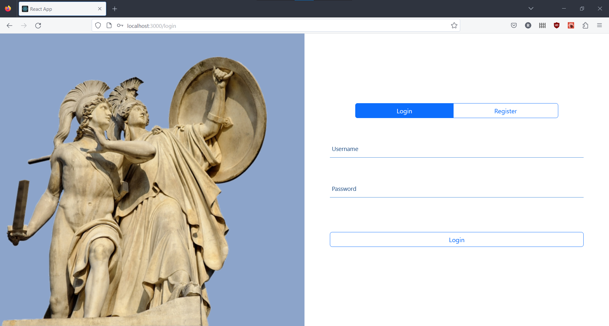
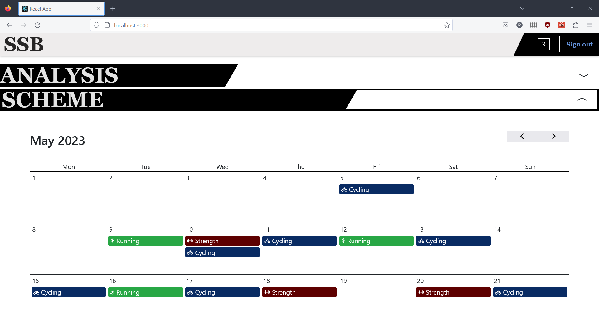
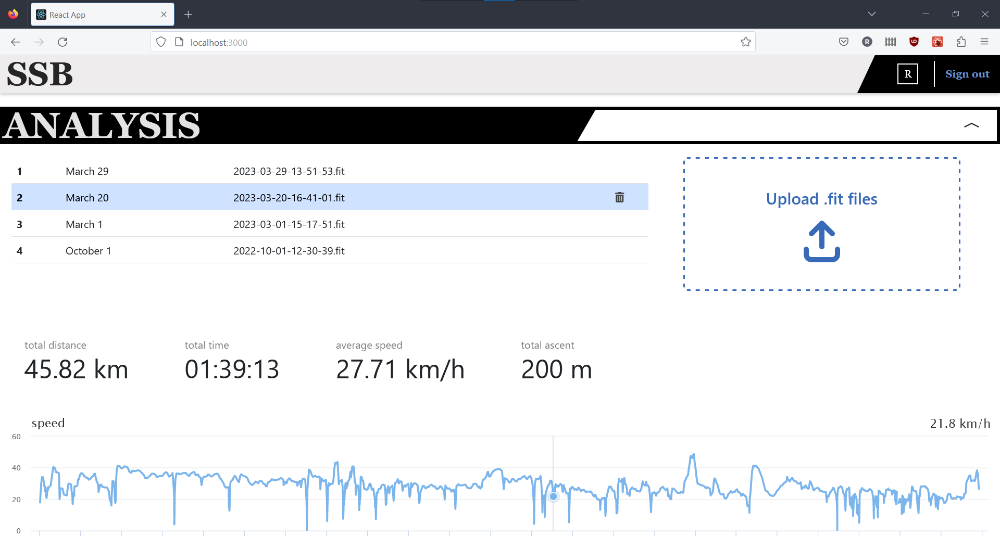
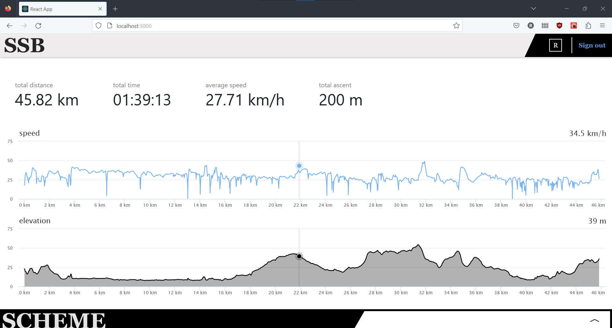
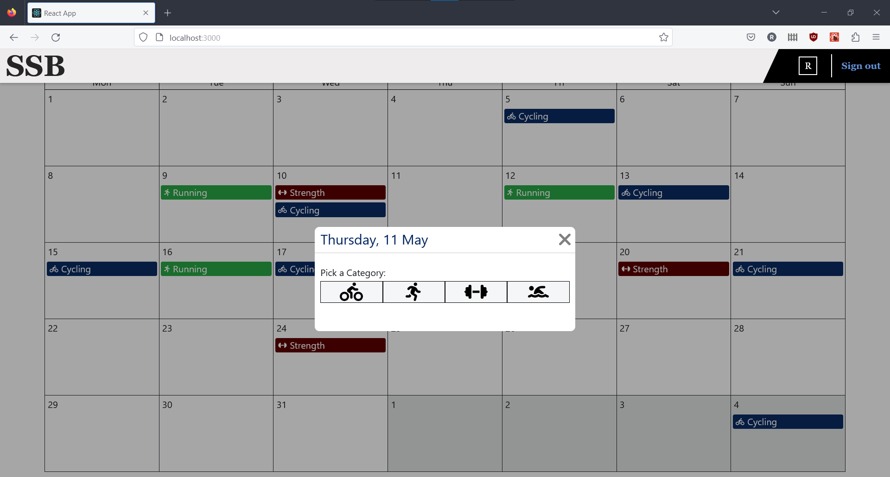
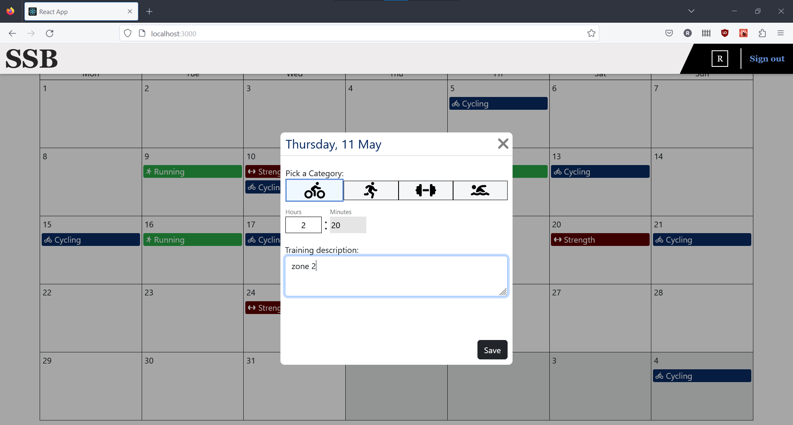
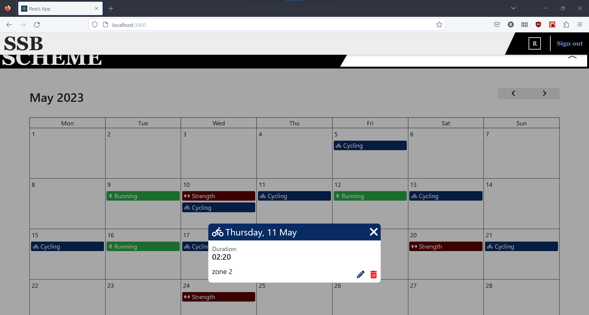
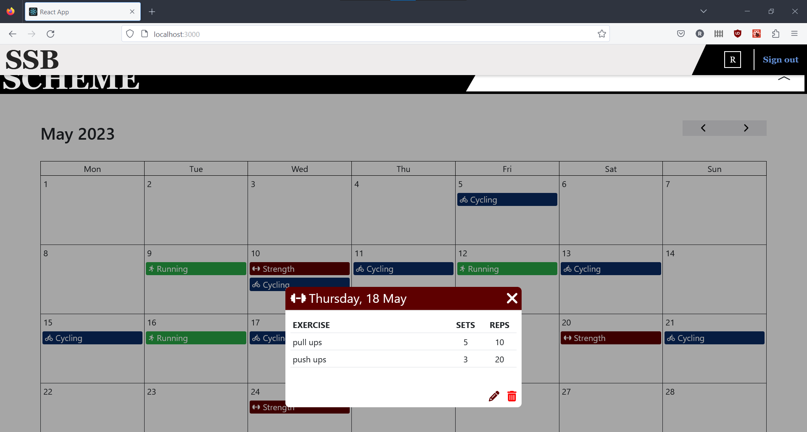
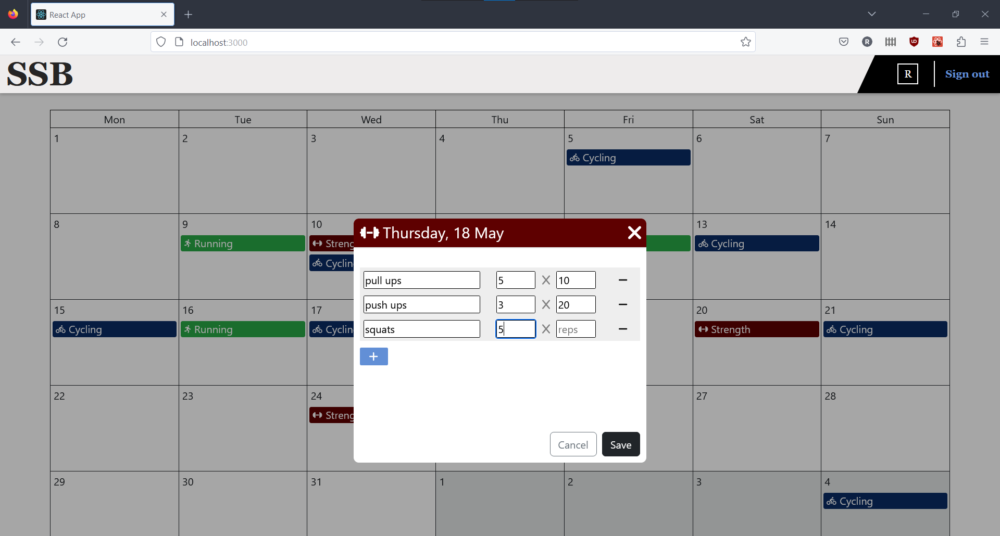

  
   

# Analysis

  
   

https://github.com/ravenstx/SportsSchemaBuilder/assets/103364044/887428d0-12d0-4132-83a7-f130341a5695

# Scheme

   
   
   

   
   

https://github.com/ravenstx/SportsSchemaBuilder/assets/103364044/1ab9dd1f-6629-44bf-8e90-f29d92db54e7

# Introduction

A user based full stack app with jwt & refreshtokens for authentication and authorization where the user can store its Garmin(cyclingcomputer) files in backend and analyse the data on the frontend, the user can also build a training plan by adding workouts on the calendar (the workouts allow all CRUD operations). 
This was built with a .NET Web API backend and a React frontend

# Technologies used

Backend

<ul>
<li>.NET Web API (REST)</li>
<li>Entity Framework</li>
<li>MS SQL Server</li>
<li>JSON Web Tokens</li>
<li>Authentication & Authorization</li>
</ul>

Frontend

<ul>
<li>React</li>
<li>React Router (protected routes)</li>
<li>Highcharts JS</li>
<li>Bootstrap</li>
</ul>
